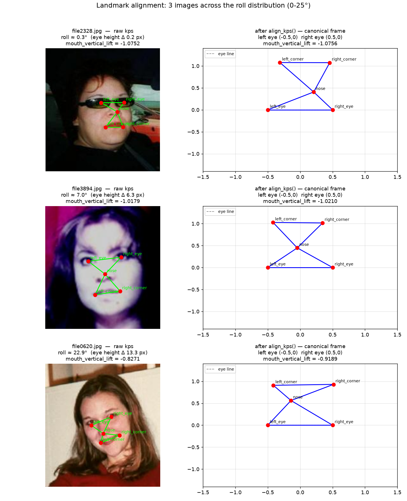
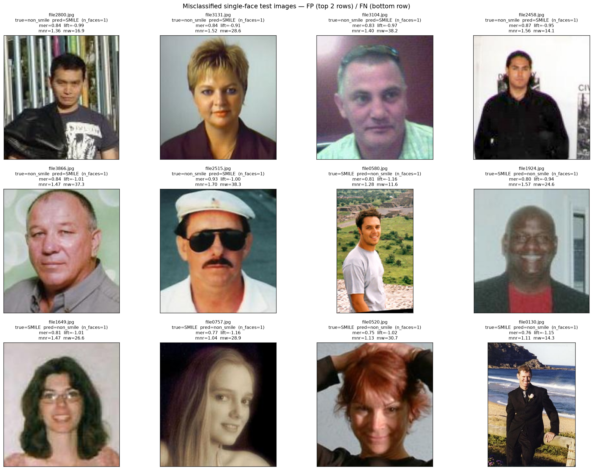

# Smile Detection

Real-time smile classification from 5 facial landmarks — CPU-only, no GPU required.

## What this is

A lightweight smile classifier that runs entirely on CPU: SCRFD landmark detection, alignment, and a logistic regression over 4 geometric features produce a verdict in ~4.4 ms per frame. It ships as a single `is_smiling(image)` function plus a live webcam demo.

## Results

Full 823-image delivery set (single-face + zero/multi-face frames); target baseline: 81.2% accuracy, 4.7 ms latency.

| Metric | Value | vs. Baseline |
|---|---|---|
| Accuracy | **0.8663** | Beats 81.2% baseline by +5.4 pp |
| Precision | **0.9067** | |
| Recall | **0.8422** | |
| F1 | **0.8733** | |
| Latency (median) | **4.42 ms** | 6% under 4.7 ms target |
| Latency (p95) | **5.47 ms** | Exceeds under load (tail from hard fallback images) |

## Before / After

| Before | After |
|---|---|
|  |  |
| *Landmark alignment correcting head-roll on high-tilt faces* | *Detection-recovery: hardest faces handled by fallback pipeline* |

## How it works

```text
Image
  │
  ▼
SCRFD Detection (ONNX, 5-point)
  │        │
  │        └─ single face? no → return Not Smiling
  │
  ▼
Landmark Alignment (rotation + scale → canonical eye frame)
  │
  ▼
Geometric Feature Extraction (4 features)
  │   • mouth_eye_ratio
  │   • mouth_vertical_lift
  │   • mouth_nose_ratio
  │   • mouth_width
  ▼
StandardScaler → Logistic Regression (C=0.1)
  │
  ▼
Smiling / Not Smiling (threshold 0.5)
```

Only 5 landmarks are used instead of a full CNN because the goal is speed and portability: the pipeline runs on CPU in ~4.4 ms/frame with a single 1.5 KB model bundle. Four geometric features capture mouth-opening and mouth-lifting, and a logistic regression separates them reliably on this benchmark.

## Quickstart / installation

Python 3.10+, no GPU. On first use the detector downloads the SCRFD model (`buffalo_sc`) from insightface releases.

```bash
pip install -r requirements.txt
```

## Usage example

```python
import cv2
from src.smile_detector import is_smiling

img = cv2.imread("photo.jpg")
print("smiling:", is_smiling(img))  # True / False
```

Run the live webcam demo (`q` to quit):

```bash
python src/webcam_demo.py
```

## Project structure

```text
src/                  detector, features, smile_detector, webcam demo
models/classifier/    shipped model bundle (final_model.pkl)
notebooks/            training, benchmark, error analysis
outputs/              benchmark results (CSV + misclassification grid)
data/eda/             figures used in this README
requirements.txt
```

## Known limitations

- **Image quality sensitivity:** accuracy drops on bright/overexposed and blurry frames — the main single-face error source.
- **Multi-face frames are skipped by design:** `is_smiling()` returns `False` unless exactly one face is detected; a genuinely smiling subject in a multi-face frame is counted as not smiling.
- **One edge-case image** (`file2669.jpg`: brightness 90, blur 769) needs the full grayscale + zoom-crop fallback chain to resolve, and is the driver of the worst-case latency tail.

## Acknowledgments / citation

Training and evaluation use the [MPLab GENKI Database, GENKI-4K Subset](https://mplab.ucsd.edu/36/), cited as:

```bibtex
@misc{GENKI-4K,
  Author = {\url{http://mplab.ucsd.edu}},
  Title  = {{The MPLab GENKI Database, GENKI-4K Subset}}
}
```

Face detection and landmarks use the SCRFD detector ([InsightFace](https://github.com/deepinsight/insightface), buffalo_sc / `det_500m.onnx`) via ONNX Runtime.