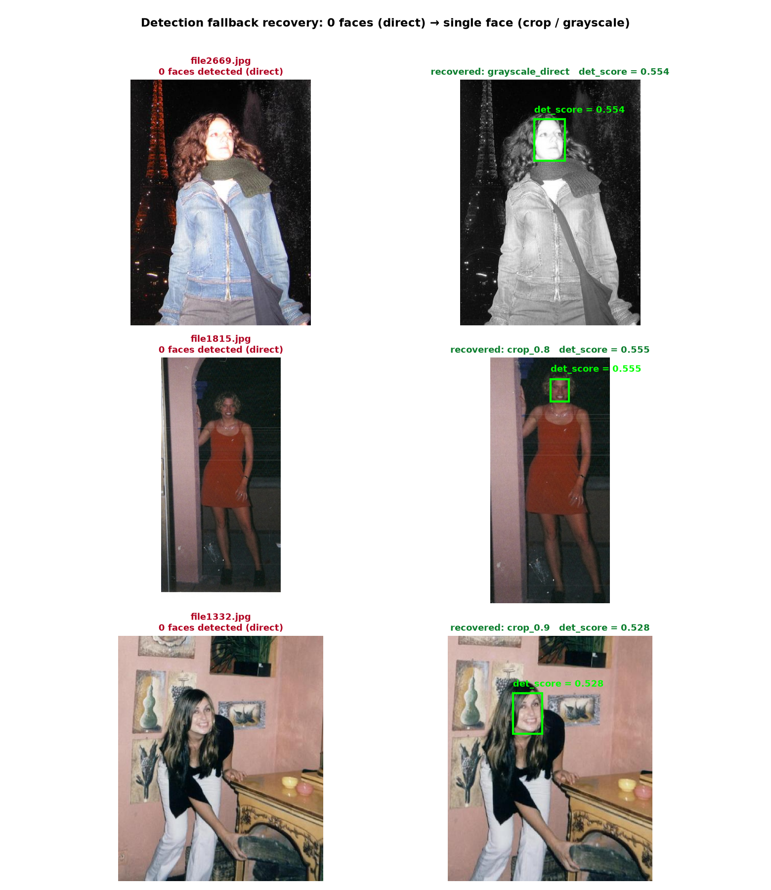
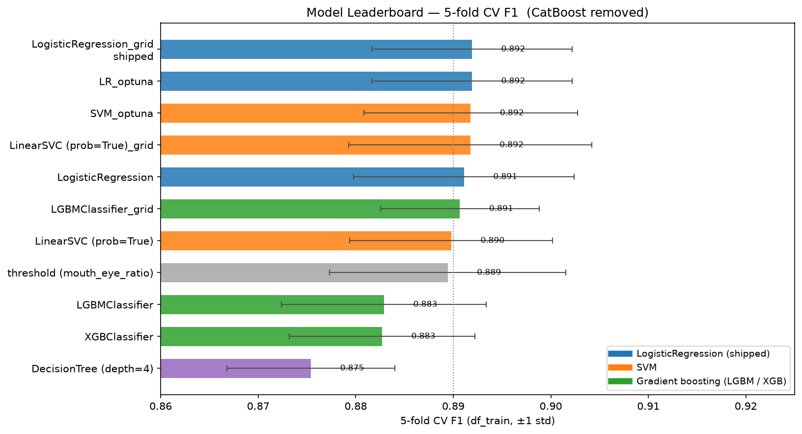
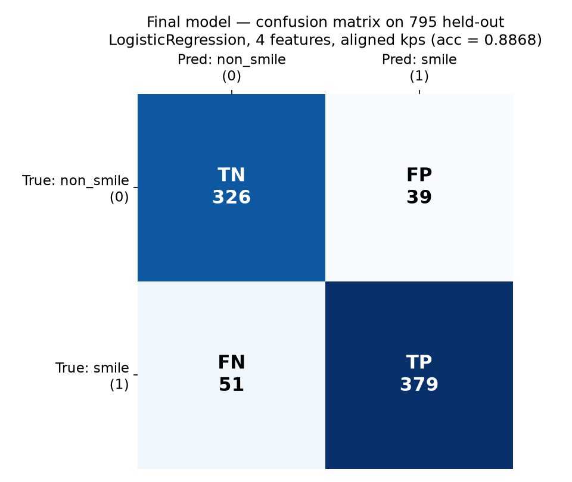
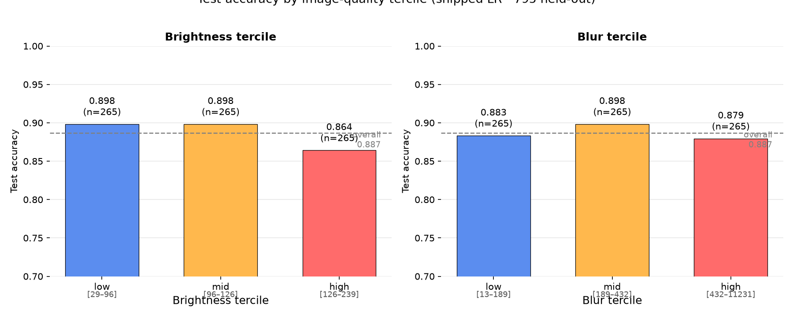
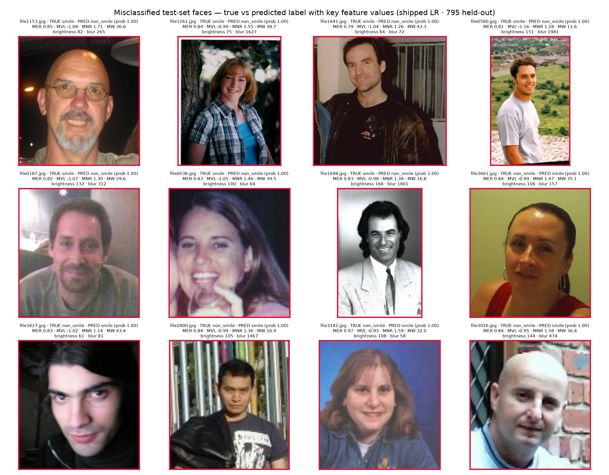
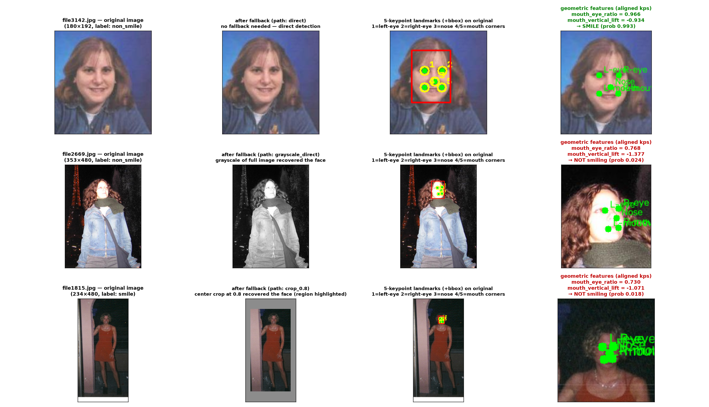

# Smile Detection

**Real-time smile classification from 5 facial landmarks — CPU-only, no GPU required.**

A lightweight smile detector built for an eKYC liveness pipeline, migrating from dlib's dense 68-point facial landmark model to a 5-point SCRFD detector. The entire smile decision is derived from geometric relationships between 5 coordinates — no neural network beyond the fixed, tiny face detector, no GPU, and a classifier small enough to fit in a text message.

---

## Table of contents

- [Why this is hard](#why-this-is-hard)
- [Results at a glance](#results-at-a-glance)
- [The journey](#the-journey)
- [Experiments that didn't make the cut](#experiments-that-didnt-make-the-cut)
- [Error analysis](#error-analysis)
- [Data quality](#data-quality)
- [How it works](#how-it-works)
- [Quickstart](#quickstart)
- [Usage](#usage)
- [Project structure](#project-structure)
- [Known limitations](#known-limitations)
- [Citation](#citation--acknowledgments)

---

## Why this is hard

Most smile detectors either run a CNN on the whole face crop, or work from dlib's 68-point mesh, which includes roughly 20 points tracing the full outline of the mouth. Both give a rich, direct signal of mouth shape.

This project has neither. The face detector — SCRFD, run directly via ONNX Runtime instead of the heavier `insightface` package — only outputs **5 points**: left eye, right eye, nose, left mouth corner, right mouth corner. That's it. No mouth outline, no jaw, no eyebrows. The entire smile signal has to be reconstructed from geometric relationships between 5 coordinates, which is a meaningfully harder classification problem than either of the standard approaches — and the point of this project.

## Results at a glance

Measured on the complete 823-image delivery set (795 single-face images the classifier actually judges, plus 28 zero-face/multi-face frames that are automatically rejected by design). Target baseline, inherited from the previous dlib-based system: **81.2% accuracy, 4.7 ms/image latency**.

| Metric | Value | vs. Target |
|---|---|---|
| Accuracy | **86.63%** | +5.4 points over target |
| Precision | **90.67%** | 9 in 10 "smiling" calls are correct |
| Recall | **84.22%** | 8.4 in 10 real smiles are caught |
| F1 | **87.33%** | Balanced precision/recall |
| Latency (median) | **~4.1 ms** | Comfortably under 4.7 ms |
| Latency (p95) | **~5.2–5.7 ms** | Exceeds target under system load — see [limitations](#known-limitations) |

*Source: `outputs/benchmark_summary.csv`, model bundle `models/classifier/final_model.pkl`.*

---

## The journey

### 1. The detector didn't see everyone

Running SCRFD as-is on the full labeled dataset, **6 images produced zero detected faces** — visual inspection showed a common cause: the face occupied a small fraction of the frame. SCRFD resizes every input to a fixed 160×160 before running inference, so a small, distant face shrinks even further and drops below the detection confidence threshold.

The fix is a **progressive fallback chain**: if the direct pass finds nothing, retry on a series of center crops (scales 0.9 → 0.4), interleaved with a grayscale-converted version of each crop. One image (`file2669.jpg`) needed the full chain — a genuine color/contrast issue stacked on top of the size problem. Every crop-local coordinate is translated back into the original image's coordinate space before any feature is computed, so downstream logic never has to know a fallback happened.

**Result: 6 → 0 undetectable images**, with the fallback chain reordered mid-project (grayscale interleaved per scale, rather than tried only as a last resort) to cut the worst-case detection latency roughly in half.



### 2. Turning 5 points into 4 signals

With no mouth outline available, the only usable geometry is **how wide the mouth is** and **how lifted its corners are**, both normalized against stable reference distances so they hold up regardless of face size or distance from the camera:

| Feature | What it captures | Separability (Cohen's d) |
|---|---|---|
| `mouth_eye_ratio` | mouth width ÷ inter-eye distance | 2.33 |
| `mouth_vertical_lift` | mouth-corner height relative to the eye line | 1.38 |
| `mouth_nose_ratio` | mouth width ÷ nose-to-eye distance | 0.70 |
| `mouth_width` | raw mouth-corner span | 0.62 |

Every feature is a ratio, not a raw distance (except `mouth_width`, kept for model-based candidates) — this makes them **scale-invariant by construction**: the same smile produces roughly the same feature values whether the face fills the frame or sits far from the camera.

Landmarks are also passed through a **similarity alignment** step before feature extraction — rotating and scaling all 5 points so the eyes sit at fixed canonical positions. This costs about 70 microseconds per frame and provides free insurance against head roll, even though (see below) it didn't move the accuracy needle on this particular benchmark.


### 3. Choosing a model — and confirming there's nothing better

Every plausible classifier was benchmarked on the same held-out split, same 4 features, same random seed:

| Model | Test F1 | Median latency | Note |
|---|---|---|---|
| DecisionTree (depth 4) | 0.897 | 0.22 ms | Statistically tied with LR (McNemar p = 0.74) |
| **LogisticRegression** | **0.894–0.896** | **0.42–0.55 ms** | **Shipped** |
| Threshold rule (`mouth_eye_ratio`) | 0.895 | <0.01 ms | Statistically tied with LR |
| LinearSVC | 0.893 | 0.46 ms | Close behind |
| CatBoost | 0.883–0.894 | 0.81–0.84 ms | Behind |
| LightGBM | 0.887–0.891 | 1.0–1.6 ms | Behind |
| XGBoost | 0.883 | 0.52 ms | Behind |
| RandomForest | 0.887–0.891 | 19–71 ms | **Excluded — 40–170× slower than everything else** |



LogisticRegression (C=0.1) was chosen even though a couple of alternatives scored marginally higher on a given run, because those differences were tested with McNemar's exact test and found to be **statistically indistinguishable from noise** every time. LogisticRegression's real advantage isn't raw F1 — it's that it outputs a genuine calibrated probability, so the precision/recall tradeoff is one configurable number, not a fixed rule baked into a tree.

### 4. Picking the decision threshold deliberately

The default 0.5 cutoff isn't arbitrary here — it was chosen by explicitly sweeping thresholds and comparing precision/recall tradeoffs against the operating context. An eKYC liveness check is more hurt by a **false "smiling" acceptance** (letting a non-compliant frame through) than by a **false rejection** (a genuine smile that just needs a retry). Early in the project a higher threshold (0.67) was tested and shipped specifically to favor precision — cutting false accepts by over half — before being revisited and rebalanced back toward 0.5 once the dataset was independently re-verified (below), landing on the current F1-optimal, precision-recall-balanced operating point.

### 5. Cleaning the ground truth — and proving it

Automated relabeling was deliberately avoided. Instead, a geometric heuristic flagged *candidate* mislabeled images, every flagged image was reviewed by eye, and corrections were applied manually. To validate this work rather than just trust it, the labels were checked against the dataset's original, authoritative source — the [MPLab GENKI-4K release](https://mplab.ucsd.edu) — using byte-identical image matching (MD5) to pair every project image with its official counterpart.

**Result: 99.67% label agreement** (3,982 of 3,995 matched images) between the manual review and the official ground truth, with the remaining 13 disagreements confirmed as genuinely ambiguous borderline expressions rather than clear errors on either side.

---

## Experiments that didn't make the cut

Four ideas were implemented, tested with the same held-out rigor as everything shipped, and **rejected on the evidence**:

| Experiment | What it was | Result | Verdict |
|---|---|---|---|
| **Landmark augmentation** | Rotation (±10°) + Gaussian jitter on training landmarks, to synthetically expand the training set | Held-out F1 unchanged to worse (0.876 → 0.870); GENKI-4K's images are already clean, so synthetic noise didn't teach the model anything useful | **Rejected** |
| **Extended feature set** | Added `mouth_corner_angle`, `mouth_triangle_area`, `mouth_symmetry` | Correlated 0.77–0.82 with existing top features; held-out F1 dropped slightly as more were added (4-feat 0.876 → 6-feat 0.872 → 7-feat 0.870) | **Rejected** |
| **Alignment for accuracy** | Same alignment used for robustness, tested for whether it improves classification | McNemar p = 1.000 — statistically zero difference (only 2 of 795 test predictions flipped) | **Kept anyway, but only for near-zero-cost head-roll robustness — not for any measured accuracy gain** |
| **DecisionTree as the shipped model** | The top leaderboard entry by raw F1 | McNemar p = 0.74 vs. LogisticRegression — not significant | **Rejected** — LogisticRegression's calibrated probability output is more valuable than a statistically-tied F1 edge |

Every verdict above is a McNemar exact-test statement, not a judgment call on the numbers alone — this is the same discipline applied throughout: an idea only ships if it beats the current model by more than what noise alone could produce.

---

## Error analysis



On the held-out single-face test set: **TN 326 / FP 39 / FN 51 / TP 379**.



Breaking accuracy down by image quality tercile reveals the real weak point: **brightness, not blur**. Accuracy stays essentially flat across blur terciles (~0.88–0.90) but drops sharply in the brightest third of images (~0.86). Overexposed frames wash out the mouth-corner contrast the feature set depends on. Blur, somewhat counterintuitively, barely matters.



There is also a **structural recall ceiling** that no classifier can remove: frames with zero or multiple detected faces are scored `False` by design (see [How it works](#how-it-works)). Among the 823 delivery images, 28 fall into this category — some of them genuine smiles that are correctly, deliberately never given a chance to be classified.

---

## Data quality

Training and evaluation use the **GENKI-4K** subset of the MPLab GENKI database — real-world photos, not laboratory-controlled expressions, which is closer to a live deployment than most academic face datasets. Labels were manually reviewed, then independently cross-validated against the dataset's official release, reaching **99.67% agreement** before the final model was trained (see [The journey, step 5](#5-cleaning-the-ground-truth--and-proving-it)).

---

## How it works

```text
Image
  │
  ▼
SCRFD face detection (ONNX, CPU)
  │
  ├─ 0 faces  ──► retry: grayscale + crop fallback (scales 0.9 → 0.4)
  │                  still 0 faces? ──► return False
  │
  ├─ 2+ faces ──► return False   (never guess which face to judge)
  │
  ▼  (exactly 1 face)
Landmark alignment (rotate + scale → canonical eye positions)
  │
  ▼
Geometric feature extraction
  │   mouth_eye_ratio · mouth_vertical_lift
  │   mouth_nose_ratio · mouth_width
  ▼
StandardScaler → LogisticRegression (C=0.1)
  │
  ▼
predict_proba ≥ 0.5  →  Smiling / Not smiling
```



Returning `False` on zero or multiple detected faces isn't a limitation to work around — it's a deliberate safety choice for a liveness context: if the system can't be confident *whose* face it's judging, or whether it's seeing a face at all, guessing is worse than refusing.

---

## Quickstart

Requires Python 3.10+. No GPU needed. The SCRFD model (`buffalo_sc`, ~2.5 MB) downloads automatically on first use.

```bash
git clone https://github.com/Mohamed-Maher5/Smile-Detection.git
cd Smile-Detection
python -m venv venv
source venv/bin/activate        # Windows: venv\Scripts\activate
pip install -r requirements.txt
```

## Usage

**Single image:**

```python
import cv2
from src.smile_detector import is_smiling

img = cv2.imread("photo.jpg")
print("smiling:", is_smiling(img))   # True / False
```

**Live webcam demo** (press `q` to quit):

```bash
python src/webcam_demo.py
```

The live demo shows the detected face's bounding box and 5 landmarks, a smoothed smile probability (rolling average + hysteresis, to avoid flicker on borderline expressions), and the live detection confidence.

---

## Project structure

```text
src/
  face_detector.py      SCRFD wrapper (provided, unmodified)
  preprocessing.py       detection fallback (crop + grayscale retry)
  features.py             geometric feature extraction + landmark alignment
  smile_detector.py       is_smiling() — the deliverable
  webcam_demo.py           live demo with keypoints, bbox, and smoothing
models/classifier/
  final_model.pkl          shipped model bundle (scaler + LogisticRegression + threshold)
notebooks/
  01_data_prep.ipynb        dataset loading and label correction
  02_eda.ipynb                brightness/blur/detection-score exploration
  03_feature_engineering.ipynb   feature design and separability analysis
  04_modeling.ipynb              model leaderboard and selection
  05_deployment_benchmark.ipynb  end-to-end accuracy and latency benchmark
outputs/
  benchmark_results.csv, benchmark_summary.csv
data/eda/
  every figure referenced in this README
requirements.txt
```

---

## Known limitations

- **Overexposed images hurt accuracy** — the brightest tercile of images sees a real accuracy drop (~0.90 → ~0.86), since blown-out highlights wash out the mouth-corner contrast the features depend on.
- **Multi-face and no-face frames always return `False`, by design** — this is correct, deliberate safety behavior, but it puts a hard ceiling on recall across any benchmark that includes such frames; no amount of model tuning can close this gap.
- **Latency tail is load-sensitive.** Median latency comfortably beats the 4.7 ms target on every measured run; p95 latency occasionally exceeds it under system load, driven by the rare images that need the full detection fallback chain — not by the classifier itself, which runs in well under a millisecond.
- **Head yaw (turning, not tilting) isn't corrected.** Landmark alignment fixes head *roll*; a genuine left/right head turn foreshortens the face in ways a 2D similarity transform can't undo. This remains an open area for future work.

---

## Citation / acknowledgments

Training and evaluation data: the [MPLab GENKI Database, GENKI-4K Subset](https://mplab.ucsd.edu).

```bibtex
@misc{GENKI-4K,
  Author = {\url{http://mplab.ucsd.edu}},
  Title  = {{The MPLab GENKI Database, GENKI-4K Subset}}
}
```

Face detection and landmarks: the SCRFD detector via [InsightFace](https://github.com/deepinsight/insightface) (`buffalo_sc` / `det_500m.onnx`), run directly through ONNX Runtime.
